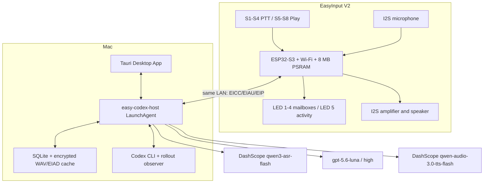
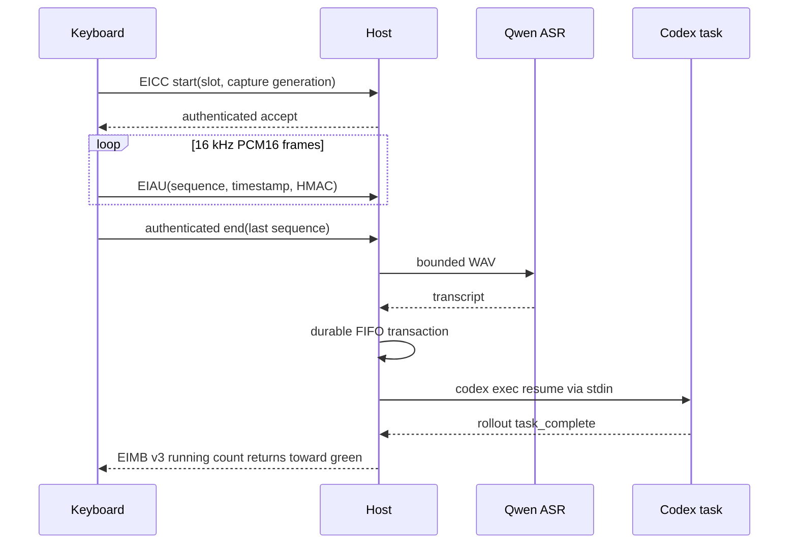
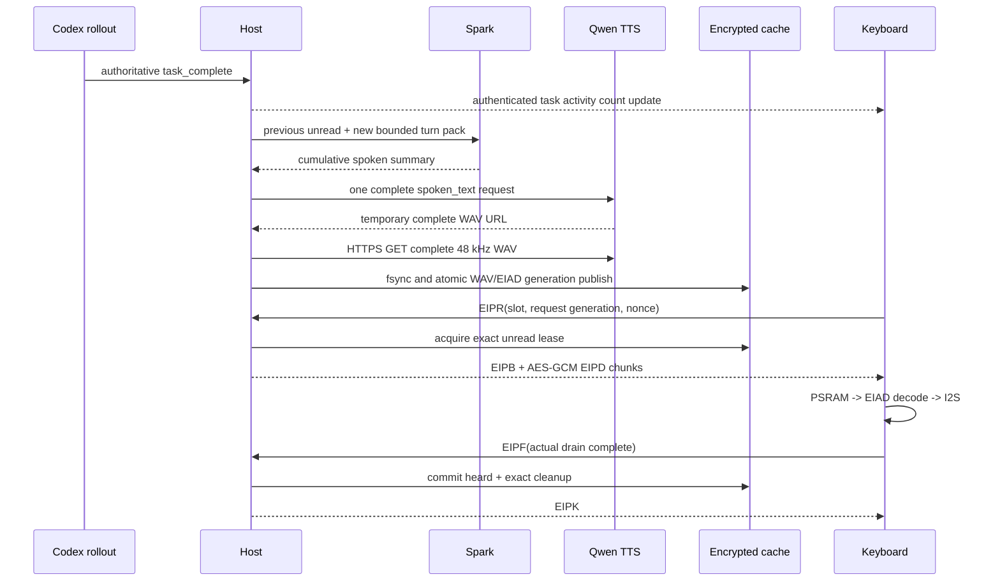

# Codex Keyboard 端到端架构

## 拓扑



## PTT 时序



## 总结和播放时序



## 本地文件

```text
~/Library/Application Support/EasyCodexInput/
├── .env                  # DashScope key, 0600
├── cache-secret.hex      # cache root key, 0600
├── device-secret.hex     # LAN device secret, 0600
├── state.sqlite3
├── bin/easy-codex-host
├── run/host.sock
├── logs/host.log
└── cache/
```

Host 是唯一后台服务。Tauri 关闭后，Codex observer、FIFO、Spark/TTS 和未读缓存仍继续运行。

## 故障语义

- Host 离线：固件不缓存 task 请求，不猜测绑定。
- Wi-Fi 断线：当前采集/播放 generation 失败并保留未读。
- PTT 抢占：固件立即停止播放，向 Host 重发 cancel，录音不等待 cancel ACK。
- final data ACK/EIPF/EIPK 丢失：双方以相同 identity 幂等重发。
- Host 重启：未完成 playback lease 恢复为 unread；不把“传输完成”当“听完”。
- cache 损坏：fail closed，不删除引用；需要重新生成或人工处理。
